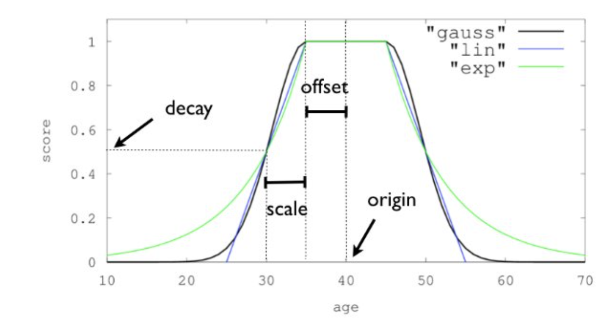

# Configuration break down

The configuration for Canonical Types is as follows, as illustrated by this sample config.

```yaml
Boxers:
    index: canonical_boxers
    fields:
        - name: height
          type: float
          required: true
          boost: 1.0
          decay:
              decay: 0.5
              offset: 1
              scale: 5
        - name: weight
          type: double
          required: false
          boost: 1.0
          decay:
              decay: 0.9
              offset: 10
              scale: 5
        - name: name
          type: text
          required: true
          boost: 1.0
          fuzziness:
              enabled: true
        - name: reach
          type: long
          required: true
          boost: 0.5
          decay:
              decay: 0.9
              offset: 10
              scale: 5
        - name: fights
          type: integer
          required: true
          boost: 0.7
          decay:
              decay: 0.9
              offset: 10
              scale: 5
        - name: wins
          type: integer
          required: true
          boost: 0.7
          decay:
              decay: 0.9
              offset: 10
              scale: 5
        - name: losses
          type: integer
          required: true
          boost: 0.7
          decay:
              decay: 0.9
              offset: 10
              scale: 5
        - name: draws
          type: integer
          required: true
          boost: 0.7
          decay:
              decay: 0.9
              offset: 10
              scale: 5
        - name: kos
          type: number
          required: true
          boost: 0.3
          decay:
              decay: 0.9
              offset: 10
              scale: 5
```


## index
The underlying index name to use - defaults to Canonical.

## fields

### name
The name of the field in question. 

### type
Rather than detail all the field types, some of which are self-evident. 
We will instead focus on the more detailed types.
#### Self Evident Types
* boolean
* double
* float
* integer
* long
* number

#### date
This represents a date or datetime, with ISO 8601 as the expected format. 

The basic format for dates in ISO 8601 is as follows:

##### Date only 
YYYY-MM-DD

##### Date with time
YYYY-MM-DDTHH:mm:ss.sssZ

##### Component breakdown

* YYYY: Four-digit year
* MM: Two-digit month (01-12)
* DD: Two-digit day of the month (01-31)
* T: Separator between date and time components
* HH: Two-digit hour of the day in 24-hour format (00-23)
* mm: Two-digit minutes (00-59)
* ss.sss: Seconds and optional fraction of a second
* Z: Indicates that the time is in UTC (Zulu time)

#### geo-point
Represents a location with longitude and latitude.
```json
{"location": {"lat": 40.7128, "lon": -74.0060}}
```
#### keyword
This indicates a text field where only exact matches matter - best used an enum equivalent of enums or fixed values.
Say a title - Mr, Mrs, Miss, Ms; or a state - unlicensed, provisional, full.

The key point is that no fuzziness or other closeness technique will be used with the field.

```json
{"type": "float"}
```
#### text
This is the most common field and  
```json
{"Description": "Some text"}
```


### required
A boolean flag dictating whether the field is to be included in the process.
There may be occasions where we have a field that is informative but not necessary or useful for similarity matching.

Defaults to true.

### boost
This provides a boost to the search that is carried out, if, the field in question matches. It's a float value and
defaults to 1.0 if not set.


### decay (optional)
Applicable only to number types. Describes a linear decay pattern that is applied to the given field as illustrated 
below. More technical information on the functions work [here](https://www.elastic.co/blog/distance-feature-query-time-and-geo-in-elasticsearch-result-ranking).
#### decay (optional)
Rate at which the value decreases over time.
A double value that defaults to 0.5.
#### offset (optional)
Constant value added after scaling. A string value that defaults to "0"
#### scale
Multiplier applied to the decayed value. A string value that must be provided.

#### Diagram
The origin value is the value of the field passed in to the search.


#### Example
If we had an origin of 50, a decay of 0.5, an offset of 10 and a scale of 10.
For the given values we would get scores as follows:
* 50 -> 1.0 (obviously)
* 40 - 60 -> 1.0 (because they are within the offset)
* 30, 60 -> 0.5 (because it is 1 scale from the offset).
* 35, 55 -> 0.75 (because it's a linear progression from 1.0 -> 0.5 so would be 0.75)
* 25, 65 -> 0.25 (because it's a linear progression from 0.5 -> 0.0 so would be 0.25)
* <20, >70 -> 0.0

### distance (optional)
Applicable to dates or locations, as the name suggests, it specialises on the proximity of terms relative to that 
passed in. A more technical description can be found [here](https://www.elastic.co/blog/distance-feature-query-time-and-geo-in-elasticsearch-result-ranking)
#### pivot
String value that defines how quickly the contribution of distance to the score diminishes.

### fuzziness (optional)
Applicable to text fields, it dictates how the search is applied. A more technical description can be found [here]
(https://www.elastic.co/blog/found-fuzzy-search).
#### enabled
Boolean flag indicating whether to use a fuzzy search (true) or an exact match (false)
#### min
Minimum n-gram length to use.
#### max
Maximum n-gram length to use.
