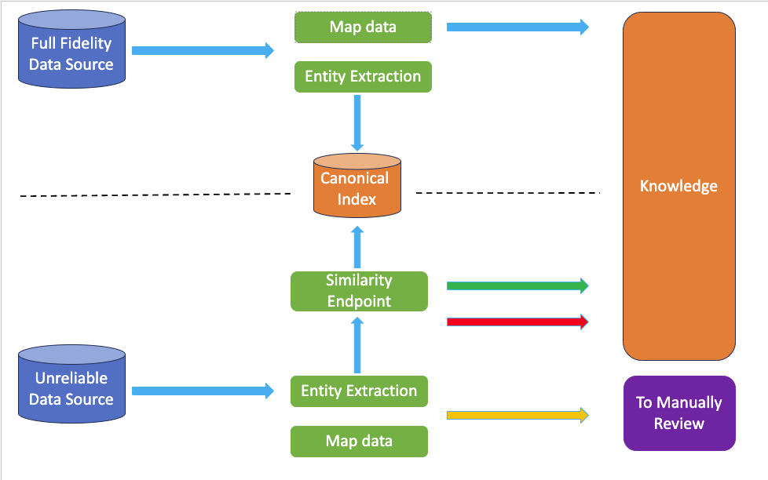

# Understanding Canonical Forms in Entity Resolution
## What are Canonical Forms?

In Entity Resolution (ER), canonical forms are a way to represent entities consistently. This ensures that even if information about the same real-world entity appears differently across various datasets, it can still be accurately matched and identified.

### Think of it like this
Imagine you're looking for information about a specific car. You might find details 
about it in a government database (reliable source), a police report (less reliable source), and an insurance claim (unreliable source). Each source might use slightly different formats or terminology. Canonical forms help standardize this information into a common structure, making it easier to recognize that all these descriptions refer to the same car.

## Benefits of Canonical Forms

### Improved Accuracy 
By standardizing data, canonical forms reduce errors caused by inconsistencies and variations in how entities are represented.
Enhanced Efficiency: Matching entities becomes faster and more efficient when they're all presented in a consistent format.
Better Scalability: As you deal with larger datasets, having a standardized representation allows for more efficient processing and matching.

## How Canonical Forms Work
### Standardization
This involves transforming data from various sources into a common format. For example, names 
might be converted to a specific format (e.g., last name, first name), addresses might be formatted consistently, and abbreviations might be expanded.

### Attribute Mapping
Attributes from different sources are mapped to a common set. For instance, "color" from one 
source might be mapped to "colour" from another, ensuring both refer to the same concept.
### Feature Extraction
Key features or characteristics are extracted from entity attributes. These might include things like unique identifiers (VIN for vehicles), tokenized versions of text (e.g., separating words in a name), or geospatial information (e.g., location data). Feature extraction aids in the comparison process during ER.

## Key Components of a Canonical Form
A well-defined canonical form will typically include a set of critical attributes that are essential for matching entities. These attributes are chosen based on the specific type of entity and the most reliable indicators of a match.

### Example: Matching Vehicles

Let's look at how canonical forms can be used to match information about vehicles from different sources:

#### High-Fidelity Source
This could be a trusted source like a government vehicle registration database, containing 
detailed and accurate information about each vehicle.
#### Medium-Fidelity Source
This might be a police report describing a vehicle involved in an incident. The details 
provided could depend on the situation.
#### Low-Fidelity Source
This could be an eyewitness report mentioning a vehicle's type and color, with potentially 
subjective or incomplete information.

#### Canonical Vehicle Definition

We can define a canonical form to represent a vehicle entity, including key fields like license plate number, manufacturer, vehicle type, VIN (Vehicle Identification Number), number of doors, and year of manufacture.

#### Matching Process

Information from each source is extracted and mapped to the corresponding fields in the canonical form (if available).
The extracted data is then used to query a similarity endpoint (a matching algorithm).
The similarity score determines how likely it is that the data refers to the same vehicle:
High Score (e.g., 90% or above): Indicates a successful match. The data is used to update or add details to the existing record in the canonical index (a central repository of standardized entities).
Low Score (e.g., 10% or below): Indicates no match. If enough data is available, a new entry is created in the canonical index. Otherwise, the data might be discarded.
Mid-Range Score: Indicates an uncertain match. Manual intervention might be needed to determine if the data refers to a new or existing vehicle.
Conclusion:

Canonical forms are a valuable tool in Entity Resolution, contributing to cleaner, more accurate, and efficient data integration. They ensure consistent data representation across diverse sources, facilitating the identification and linking of related records.

## Detailed Use Case

We will consider vehicles and will assume we are collating data from different sources with a range of fidelity.

#### Full fidelity
In this case, The Driver and Vehicle Licensing Agency (DVLA). As close to a 100% reliable, trusted source as 
possible, holding more than 40 million vehicle records. 

Let's imagine it's something like this. 
```json
{
  "vehicle": {
    "registration_number": "AB12 CDE", 
    "vehicle_identification_number": "JM1FC3510J0103702",
    "make": "Toyota",
    "model": "Corolla",
    "year": 2022,
    "color": "Blue",
    "fuel_type": "Petrol",
    "transmission": "Automatic",
    "engine_size": 1.6,
    "current_mileage": 25000,
    "owner": {
      "name": "John Doe",
      "address": "123 Main Street, London",
      "post_code": "SW1 3RT",
      "contact_number": "123-456-7890"
    },
    "mot_expiry_date": "2023-05-31",
    "road_tax_due_date": "2023-06-15",
    "insurance": {
      "provider": "ABC Insurance",
      "policy_number": "XYZ123456",
      "expiry_date": "2023-12-31"
    }
  }
}
```


#### Full-to-Partial fidelity.
Say, the [Metropolitan Police Vehicle Recovery Unit](https://www.met.police.uk/advice/advice-and-information/vr/vehicle-recovery/) 
which finds stolen, abandoned or damaged cars. The details provided would depend on the status of the car in question.

Here is what something like that could be
```json
{
  "police_report": {
    "report_number": "PRN789012",
    "date_filed": "2023-04-20",
    "incident": {
      "type": "Abandoned Burned-Out Vehicle",
      "location": "Rural Road, Countyshire",
      "date_discovered": "2023-04-18",
      "time_discovered": "09:45"
    },
    "description": "A burned-out vehicle was discovered on a rural road. The car appears to be abandoned and has suffered extensive fire damage.",
    "reported_by": {
      "name": "Officer Smith",
      "badge_number": "12345",
      "contact_number": "555-123-4567"
    },
    "vehicle_details": {
      "registration_number": "WXYZ 789",
      "make": "Volkswagen",
      "model": "Golf",
      "color": "Silver",
      "condition": "Burned-Out",
      "vehicle_identification_number": "123456789ABCDEFG"
    },
    "investigation_status": "Under Investigation",
    "additional_notes": "The vehicle has been marked for towing, and an investigation is ongoing to determine the cause of the fire and the owner of the vehicle."
  }
}
```

#### Partial fidelity
The call centre logs from an insurance company.  Most claimants will obviously know their own car details but might be 
less reliable when describing other cars. 

Let's pretend the data is something like this
```json
{
  "claim": {
    "claim_number": "CLM123456",
    "date_filed": "2023-02-15",
    "description": "Accident at an intersection",
    "status": "Pending",
    "vehicles": [
      {
        "registration_number": "AB12 CDE",
        "driver": {
          "name": "John Doe",
          "contact_number": "123-456-7890"
        },
        "damage_description": "Front bumper damage",
        "estimated_cost": 1500
      },
      {
        "registration_number": "FG34 HIJ",
        "driver": {
          "name": "Jane Smith",
          "contact_number": "987-654-3210"
        },
        "damage_description": "Rear-end collision",
        "estimated_cost": 2000
      }
    ],
    "witnesses": [
      {
        "name": "Witness 1",
        "contact_number": "555-123-4567"
      },
      {
        "name": "Witness 2",
        "contact_number": "555-987-6543"
      }
    ],
    "police_report_number": "PRN789012",
    "insurance_company": "ABC Insurance",
    "assessor": {
      "name": "Assessor Name",
      "contact_number": "111-222-3333"
    }
  }
}

```

#### Minimal fidelity
Eyewitness reports to a crime involving a vehicle. The details will be minimal, say a type and colour, but will fall 
afoul of subjectivity.

For example, it might take the following form
```json
{
  "police_report": {
    "report_number": "PRN123456",
    "date_filed": "2023-03-10",
    "incident": {
      "type": "Hit and Run",
      "location": "Main Street, London",
      "date": "2023-03-05",
      "time": "14:30"
    },
    "witness": {
      "name": "Witness Name",
      "contact_number": "555-987-6543",
      "statement": "I witnessed a hit and run incident on Main Street. A blue car with registration number AB12 CDE collided with a parked vehicle and left the scene without stopping."
    },
    "vehicles_involved": [
      {
        "registration_number": "AB12 CDE",
        "make": "Ford",
        "model": "Focus",
        "color": "Blue"
      },
      {
        "registration_number": "FG34 HIJ",
        "make": "Unknown",
        "model": "Unknown",
        "color": "Unknown"
      }
    ],
    "additional_details": "The incident was captured by a nearby CCTV camera. Video evidence is available for further investigation."
  }
}

```

## Canonical Type Definition

Each of the sources listed above will have data in their own form and format. To aid in the process we establish a 
canonical type (below) to represent a vehicle entity with some key fields below.  

The configuration details are described [here](canonical-config.md).

```yaml
Vehicle:
  index: canonical_vehicle_index
  fields:
    - name: licence
      type: text
    - name: automatic_gearbox
      type: boolean
    - name: manufacturer
      type: text
    - name: vehicle_type
      type: text
    - name: vin
      type: text
    - name: doors
      type: integer
    - name: year
      type: integer
```
We then assume that as part of the wider pipeline, the above information (if available) is extracted from each of 
the data sources. 

## Suggested Pipeline
### Diagram


### Description

#### Reliable source
As illustrated in the top half of the diagram, the trusted source has its incoming data mapped and the relevant
entity extracted both sets of data are immediately used to populate the Canonical Index and ultimate Knowledge source.

#### Unreliable source
In the bottom half, for each item of data from the unreliable source the relevant entity is extracted (as much as 
possible). It is then used to query the Similarity Endpoint. Depending on the score (and related configuration) the 
following expectations exist:

#### 🟩 <span style="color:green">Successful match</span>
If we have a score that is sufficiently high, say 90% or above, the data can then be mapped as an update or addendum 
to the existing matching entry.

#### 🟥 <span style="color:red">No match</span>
If we have a score that is sufficiently low, say 10% or less, we map the data as a brand-new entry, if sufficient 
data is provided, or discarded if not.

#### 🟧 <span style="color:orange">Uncertain match</span>
If we have a score that falls in-between our high/low thresholds, indicating that an automatic decision could not 
be made. Manual intervention may be required. 

#### Note
In the above coloured descriptions, the assumption is that there are three (or four) possible options. Depending on 
scoring and implementations it could simply be a Yes/No approach, i.e. if not 99% then any item would be considered 
needing triage. That would be dealt with on a case by case basis depending on deployment. 
