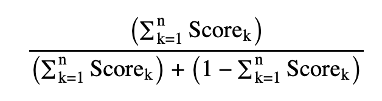
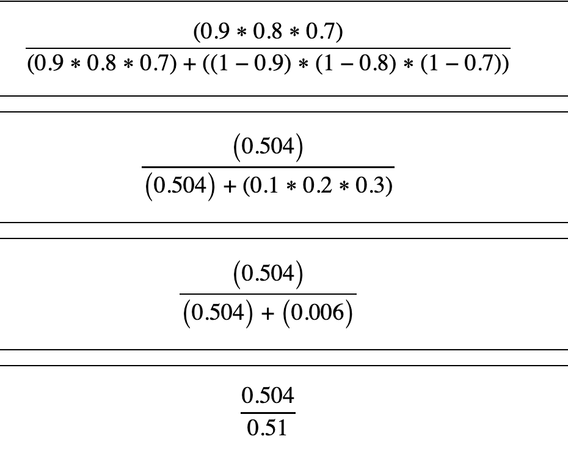

# Further work

## Implement deeper configuration model

As described [here](canonical-config.md), we have sufficient configuration to represent a canonical form.

We have a more detailed model that is partially implemented. The configuration and set-up is in place but isn't 
currently use.

### Relationships
In this model, we stitch together various fields to form meaningful relationships. Consider the natural coupling of 
'first-name' and 'surname'; such pairings are assigned weights to prioritize their significance in entity matching. 
However, recognizing the limitations of common names, this is further expanded to explore more intricate 
relations—like integrating 'middle-name' to bolster the accuracy of our matches.

* **Fields**: An interconnected list of fields
* **Weight**: The relational significance (ranging from 0 to 10)

### Scores
Central to the model is the scoring system, a gauge of a field's cardinality and accuracy. The higher the score, the greater the trust we place in the field's reliability.

* **Field**: Name of the field under scrutiny
* **Score**: A decimal value ranging from 0.0 to 1.0

### Model
The model as described is made of the following:
* **Index**: Identifier of the canonical index to apply the model too (refer to corresponding [entry](canonical-config.md#index))
* **Relations**: A compilation of relationship IDs for utilization
* **Scores**: An array of scores to apply.

When queries get made the required model ID should be passed as a parameter to indicate its use.

## Improved Scoring
### Current approach
Currently, we make heavy use of the in-built scoring mechanism that is applied by the Elasticsearch (or Open Search)
implementation. Granted that is shaped by the nature of the querying we do and the parameters and configuration 
provided but is essentially opaque. We compensate for that by normalising the scores returned in order to get a 
percentage figure (0.0 - 1.0) that we then use.

### Deficiencies
One of the problems with this approach is that matches are defined by the incoming search document. If an incoming 
document is a poor representation of the entity - say just a firstname and surname; then we could get a large number 
of 100% matches with no way of differentiating between the returned entities. 

For example, imagine we have an electoral roll data-set and are matching against an eyewitness report.

For the data stored, we may only be comparing on firstname and surname and so a "John Smith" might get a large 
number of results. If the query in question has a maxResults parameter of 1 then we will simply return the first of 
the matches which may or may not be correct.

Similarly, we need to assume that if we give back multiple 100% scores then the calling process should know that is 
indicative of a problem.

Secondly, the current approach gives similar weighting to fields that match. While there are boosts that are applied,
fundamentally if a number of fields match the Search server will consider them a better match regardless of the 
quality of those fields. 

If an incoming entity was to match on non-essential fields like blood-type, post-code, height and weight
that might take preference over an entry that has a passport no, which is obviously completely unique.

### Improved approach
Going forward, and using the config model above, we will score things differently.  We will still use the inherent 
scoring of the servers but will compliment that by 

For results with a matching score, and using the given model, we can process them as follows:
Working through the relations in weighting order until we find a result that matches and then calculate the score. 
If we have any matches on score, we continue down the chain of relations working out the score.

That will give a more accurate set of results that are ultimately returned.

#### The Scoring Mechanism
To work out the score we will use the following formula:

In simpler terms, consider a scenario with three interlinked fields and their corresponding scores:
* Phone Number - 0.9
* Date of Birth - 0.8
* Postal Code - 0.7

The scoring process unfolds as follows:

resulting in a comprehensive score of 0.988 (rounded to three decimal places).

## Explanation Plan 
Our goals extend beyond functionality; we would like to provide greater transparency of the decision-making process 
and mechanisms.

Until the above is implemented it will be difficult to detail how an explanation plan would work so this is a 
merely a placeholder. 
